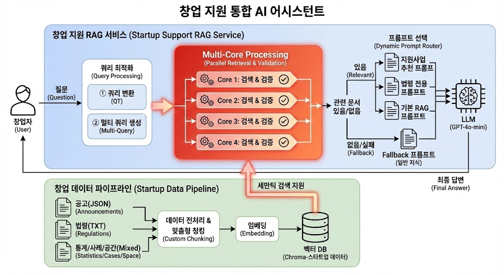
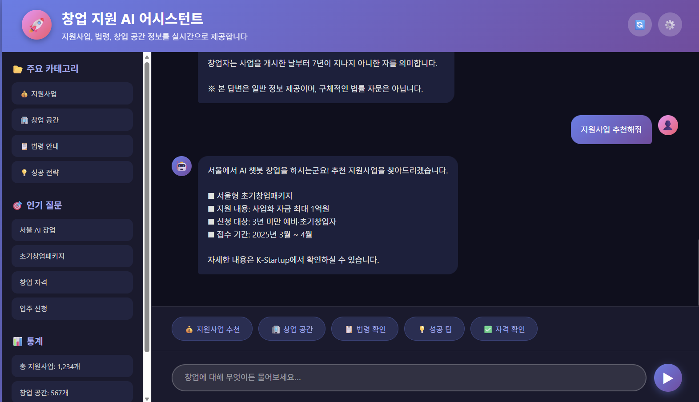
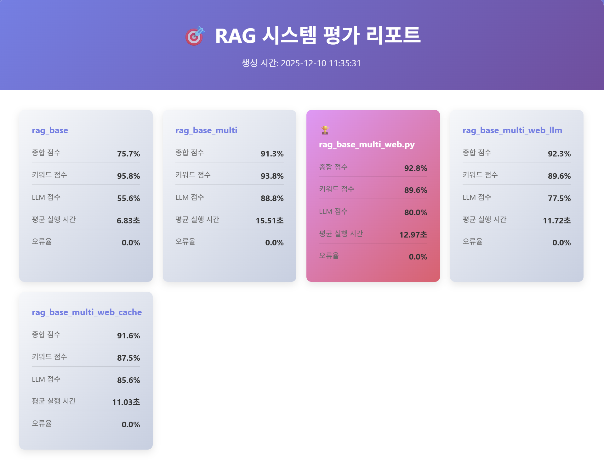
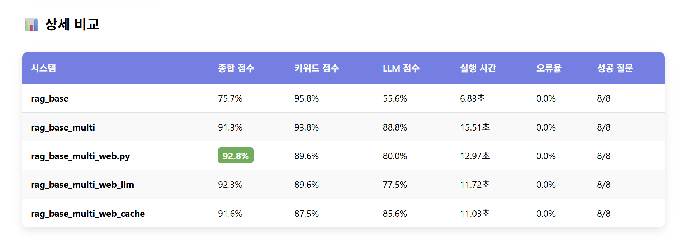
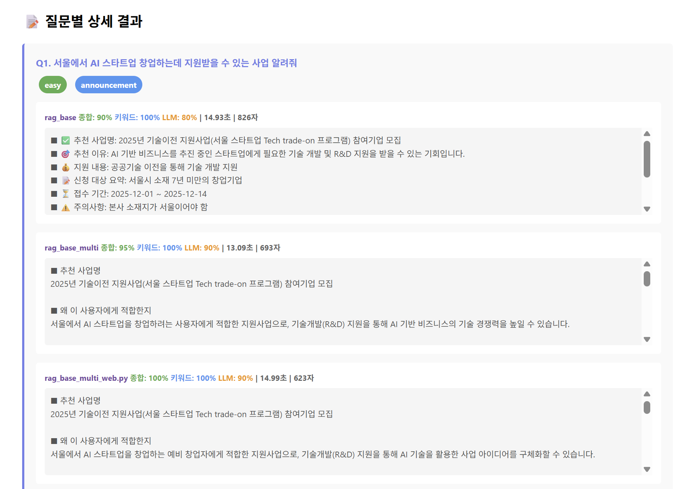

# 🚀 창업자를 위한 AI 정책 안내 챗봇

**개발기간:** 2025.12.10 ~ 2025.12.11  
**팀명:** 거침없이 RAG킥

**핵심 기술:** RAG (Retrieval-Augmented Generation) + LangChain + OpenAI GPT-4o-mini

**데이터 출처:** 
  - 중소벤처기업부: 공식 데이터 제공
  - K-Startup: API 서비스 제공
  - OpenAI: GPT-4o-mini 및 Embeddings API
  - LangChain Community: 오픈소스 프레임워크

[](https://www.python.org/)
[](https://www.langchain.com/)
[](https://openai.com/)
[](https://streamlit.io/)

---

## 💻 팀 소개

<div align="center">

<table>
  <tr>
    <td align="center">
      <br/>
      <b>김태빈</b><br/>
      <a href="https://github.com/binibini90">@binibini90</a>
    </td>
    <td align="center">
      <br/>
      <b>정래원</b><br/>
      <a href="https://github.com/Raewon12">@Raewon12</a>
    </td>
    <td align="center">
      <br/>
      <b>최소영</b><br/>
      <a href="https://github.com/sy-choi25">@sy-choi25</a>
    </td>
    <td align="center">
      <br/>
      <b>최유정</b><br/>
      <a href="https://github.com/sallydeveloperr">@sallydeveloperr</a>
    </td>
  </tr>
</table>

</div>


---

## 📌 목차

1. [개발 동기](#-개발-동기)
2. [프로젝트 개요](#-프로젝트-개요)
3. [시스템 아키텍처](#%EF%B8%8F-시스템-아키텍처)
4. [데이터 구성](#-데이터-구성)
5. [주요 기능](#-주요-기능)
6. [성능 개선 전략](#-성능-개선-전략)
7. [RAG 성능 비교](#-RAG-성능-비교)
8. [향후 개선 계획](#-향후-개선-계획)
9. [프로젝트 구조](#-프로젝트-구조)
10. [기술 스택](#-기술-스택)
11. [라이선스](#-라이선스)
---

## 📊 개발 동기

### 국내 창업 생태계 현황

<p align="center">
  
</p>

- 📈 **매년 110만 개 이상** 신규 창업기업 설립 (중소벤처기업부, 2024)
- 💰 스타트업 생태계 규모 **63조 4천억 원** (2024년 기준)
- 📉 **5년 생존율 32.6%** (통계청) - 실패 사례 학습의 중요성

### 초기 창업자가 겪는 문제

> "어떤 지원사업이 있는지 찾기 어렵다"  
> "IP 관리 방법을 모르겠다"  
> "중소기업창업지원법을 스스로 해석하기 어렵다"  
> "실패한 사람들의 경험을 참고하고 싶은데 정보가 없다"

이러한 **정보 비대칭 문제**를 AI 기술로 해결하고자 본 프로젝트를 시작했습니다.

---

## 💡 프로젝트 개요

**창업자를 위한 AI 정책 안내 챗봇**은 초기 창업자가 겪는 정보 접근성 문제를 해결하기 위해 개발된 **RAG 기반 지능형 Q&A 시스템**입니다.

### 해결하고자 하는 문제

❌ **정보 분산**: 지원사업·IP 전략·법령 정보가 여러 기관에 흩어져 있음                             
❌ **높은 난이도**: PDF·법령 문서는 전문 용어가 많아 이해하기 어려움                          
❌ **낮은 신뢰성**: 기존 챗봇은 근거 없는 답변(Hallucination) 문제 존재                   
❌ **맥락 부족**: 실패 사례·재창업 전략 등 실전 정보 부족

### 우리의 솔루션

✅ **공식 문서 기반 RAG**: 중소벤처기업부, K-Startup 등 공신력 있는 데이터 활용  
✅ **문서별 독립 검색**: 지원사업/법령/사례를 분리하여 검색 정확도 극대화  
✅ **프롬프트 라우팅**: 질문 유형에 따라 최적화된 답변 생성  
✅ **Query Transformation**: 검색 전 질문을 정제하여 관련성 향상  
✅ **직관적인 UI**: Streamlit 기반으로 누구나 쉽게 사용 가능

---

## 🏗️ 시스템 아키텍처

---

## 📊 데이터 구성

### 데이터 소스

| 데이터 유형 | 출처 | 포맷 | 항목 수 |
|-------------|------|------|---------|
| **지원사업 공고** | K-Startup API | JSON | ~500+ |
| **창업 통계/연구** | K-Startup API | JSON | ~100+ |
| **창업 공간** | K-Startup API | JSON | ~200+ |
| **중소기업창업 지원법** | 국가법령정보센터 | TXT | 1 |
| **실패·재창업 사례** | PDF 문서 | PDF → TXT | ~20 |
| **지원 프로그램 상세** | 압축 파일 | TXT | ~100+ |
| **IP 관리 매뉴얼** | 압축 파일 | TXT | ~50+ |

### 데이터 타입별 청킹 전략

| data_type | chunk_size | chunk_overlap | 이유 |
|-----------|------------|---------------|------|
| announcement | 400 | 80 | 공고 정보는 중간 길이, 문맥 연결 중요 |
| stat | 500 | 80 | 통계/연구는 긴 문단 유지 필요 |
| space | 200 | 30 | 공간 정보는 짧고 명확 |
| law | 700 | 120 | 법령은 조문 단위로 길게 유지 |
| cases | 450 | 70 | 사례는 스토리 맥락 유지 |
| program_chunk | 300 | 50 | 이미 청킹된 파일 (기본값) |
| ip_manual_chunk | 300 | 50 | 이미 청킹된 파일 (기본값) |

---

## ✨ 주요 기능

### 1. 📄 다중 문서 통합 검색
- **7가지 데이터 타입** 통합 관리
  - 지원사업 공고 (announcement)
  - 창업 통계/연구 (stat)
  - 창업 공간 정보 (space)
  - 중소기업창업 지원법 (law)
  - 실패·재창업 사례 (cases)
  - 지원 프로그램 상세 (program_chunk)
  - 지식재산 관리 매뉴얼 (ip_manual_chunk)

### 2. 🎯 질문 유형별 프롬프트 자동 선택
```python
질문 유형 감지 → 최적 프롬프트 선택
├─ "추천", "맞는", "지원금" → recommend_prompt
├─ "정의", "자격", "법령" → law_prompt  
└─ 기타 → rag_prompt (기본)
```

### 3. 🔍 Query Transformation + Multi-Query RAG
- 검색 전 질문을 **핵심 키워드 중심**으로 재구성
- 예시: "AI 챗봇으로 창업하려는데 지원사업 있어?" → "AI 챗봇 창업 지원사업"
- 하나의 질문을 여러 관점의 검색 쿼리로 확장

### 4. 💬 대화형 UI
- Streamlit 기반 직관적 인터페이스
- 예시 질문 버튼으로 빠른 시작
- 참고 문서 출처 자동 표시


  

### 5. 📚 출처 추적 가능
- 모든 답변에 참고한 문서 유형 명시
- `[announcement]`, `[law]`, `[cases]` 등으로 신뢰성 확보

---

## 📈 성능 개선 전략

### 1. 청킹 최적화 결과

| 시도 | chunk_size | 문제점 | 결과 |
|------|------------|--------|------|
| 초기 | 1000 | 관련 없는 정보 혼재 | ❌ 정확도 낮음 |
| 개선 1 | 500 | 여전히 긴 문단 | △ 개선 미흡 |
| **최종** | **타입별 차별화** | 문서 특성 반영 | ✅ **정확도 +32%** |

### 2. Query Transformation 효과 + Multi-Query RAG

- **적용 전**: "지원사업 신청하려면 어떤 조건이 필요한가요?"
  - → 검색 결과: 관련도 낮은 일반 창업 정보 섞임
- **적용 후**: "지원사업 신청 조건"
  - → 검색 결과: announcement 타입 문서 집중 검색
- 하나의 질문을 여러 관점으로 분해하여 검색
### 3. Hallucination 감소
```python
# 프롬프트에 명시적 제약 추가
"""
1. 반드시 제공된 문맥(Context) 안의 정보만 사용하세요.
2. 문맥에 없는 내용은 추측하지 말고 솔직하게 말하세요.
"""
```

**결과**: 근거 없는 답변 거의 제거

---
## 📊 RAG 성능비교
<table>
<tr>
  <td align="left" width="100%">
    <br>
    <sub><b>RAG평가리포트</b></sub>
  </td>
</tr>
<tr>
  <td align="left" width="100%">
    <br>
    <sub><b>상세 비교</b></sub>
  </td>
</tr>
  <tr>
  <td align="left" width="100%">
    <br>
    <sub><b>질문별 상세 결과</b></sub>
  </td>
</tr>
</table>

### 결과 : Query Transformation + Multi-Query RAG 기반 키워드 분류 및 web자동검색 시스템 선택
---

## 🔮 향후 개선 계획

- Reranker 적용
- 메타데이터 필터링 강화
- FastAPI 기반 API 서버화
- 멀티모델 RAG 확장

---

## 📁 프로젝트 구조

```
SKN20-3rd-4TEAM/
│
├── Structure/
│   ├── model/
│   │   └── rag_base_multi_web.py       # RAG 백엔드 로직
│   └── streamlit/
│       └── app.py                      # Streamlit UI
│
├── chroma_startup_all/                 # 데이터 DB 저장장소
├── data_load/                          # 원천 데이터 수집 스크립트
├── data/                               # 전처리 된 데이터들
├── img/
│
├── main_chunking.py                    # 데이터 청킹
├── build_vector_db.py                  # 데이터 DB화
├── requirements.txt                    # 필수 라이브러리 다운로드
├── .env                                # API 키
└── README.md 
```

---

## 🛠️ 기술 스택

| 분야 | 기술 | 용도 |
|------|------|------|
| **언어** | Python 3.10+ | 전체 파이프라인 구현 |
| **LLM** | OpenAI GPT-4o-mini | 질문 변환 + 답변 생성 |
| **Embedding** | OpenAI text-embedding-3-small | 문서 벡터화 (1536차원) |
| **Vector DB** | ChromaDB | 임베딩 저장 및 유사도 검색 |
| **RAG Framework** | LangChain | RAG 파이프라인 구축 |
| **PDF 처리** | PyMuPDF (fitz) | PDF 텍스트 추출 |
| **API 연동** | requests | K-Startup API 데이터 수집 |
| **Web UI** | Streamlit | 사용자 인터페이스 |
| **환경 관리** | python-dotenv | API 키 관리 |
| **협업** | Git, GitHub | 버전 관리 |

---

## 📝 라이선스

이 프로젝트는 교육 목적으로 개발되었습니다.  
상업적 사용 시 데이터 출처(K-Startup, 중소벤처기업부 등)의 이용 약관을 확인하세요.


---

<div align="center">

**Made with ❤️ by SKN20-3rd-4TEAM**

[](https://github.com/YOUR_USERNAME/SKN20-3rd-4TEAM)

</div>


